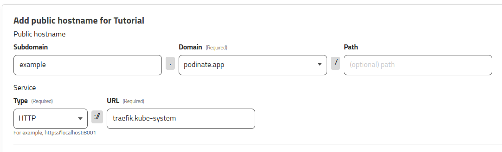

# Cloudflare Tunnel
[Cloudflare Tunnels](https://developers.cloudflare.com/cloudflare-one/connections/connect-networks/) are a way to connect your Kubernetes cluster to the internet via Cloudflare. The tunnel creates a connection out from a Pod in the cluster to Cloudflare's datacenters, so there's no need to configure port forwarding or certificates. 

## Install
Create a Cloudflare Tunnel by following [Cloudflare's Create Tunnel Documentation](https://developers.cloudflare.com/cloudflare-one/connections/connect-networks/get-started/create-remote-tunnel/). 

!!! important
    In step 2 of the Cloudflare documentation, specify the service of the ingress controller on the cluster. To determine the value, run the following command:
    ```bash
    kubectl get services -A
    ```
    Look for the service of type "LoadBalancer". Most commonly it wil be Traefik or Nginx based.
    ```
    NAMESPACE     NAME             TYPE           CLUSTER-IP      EXTERNAL-IP   PORT(S)                      AGE
    default       kubernetes       ClusterIP      10.43.0.1       <none>        443/TCP                      3h11m
    kube-system   kube-dns         ClusterIP      10.43.0.10      <none>        53/UDP,53/TCP,9153/TCP       3h11m
    kube-system   metrics-server   ClusterIP      10.43.216.58    <none>        443/TCP                      3h11m
    kube-system   traefik          LoadBalancer   10.43.190.127   172.19.0.2    80:31351/TCP,443:31569/TCP   3h10m
    uptime-kuma   kuma             ClusterIP      10.43.210.69    <none>        80/TCP                       113m
    ```
    In this example, set the tunnel to forward all traffic to `http://traefik.kube-system`. Traefik will be installed by default for any Kubernetes cluster installed with k3d or k3s. For a default [Nginx ingress controller](../kubernetes/ingress.md) setup, this should be set to `http://ingress-nginx-controller.ingress-nginx`. 



You can use the following PodFile to install the Cloudflare Tunnel connector on the Podinate cluster:
```hcl
podinate {
    package = "tunnel"
    namespace = "cloudflare-tunnel"
}

pod "tunnel" {
    image = "cloudflare/cloudflared"
    arguments = [
        "tunnel",
        "--no-autoupdate",
        "run",
        "--token",
        "<your-token-here>"
    ]
    
}
```
Replace <your-token-here> with the long random string from the Cloudflare tunnel dashboard. 

## Send traffic to your Pod
In the Pod you want to expose through Cloudflare, add the following:
```hcl
service {
    port = 80
    target_port = 8080 // Optional
    ingress {
        hostname = "tunnel.example.com
    }
}
```
For example, the following PodFile will create a container running a clone of the 2048 game, and expose it at `tunnel.example.com`.
```hcl 
podinate {
    package = "2048"
    namespace = "2048"
}

pod "game" {
    image = "alexwhen/docker-2048"
    service "game" {
        port = 80
        ingress {
            hostname = "tunnel.example.com"
        }
    }
    environment "PORT" {
        value = "80"
    }
}
```
The service may take a minute or two to be available.

## Debugging
Try the following if the service you're trying to expose won't become available through CloudFlare:

- Check the target Pod's logs.
- Check the target Pod started correctly with `kubectl -n 2048 describe pod game-0`
- Check the logs of the ingress controller Pod to see if the request is coming to the ingress controller.
- Check the hostname is set to go through the tunnel on CloudFlare's side. 
- Check the created service works by running `kubectl -n 2048 port-forward service/game 8080:` and navigating to `http://localhost:8080` in your browser.
- Check you are using the *IngressClass* associated with the ingress service Cloudflare is pointed to. List the ingress classes with `kubectl get ingressclasses`. An ingressclass can be specified on the ingress block with `ingress { ingress_class = "nginx" }`.

## See Also
- [Official Documentation](https://developers.cloudflare.com/cloudflare-one/connections/connect-networks/)
- [Create Tunnel - Cloudflare Documenation](https://developers.cloudflare.com/cloudflare-one/connections/connect-networks/get-started/create-remote-tunnel/)
- [Nginx Ingress Controller](../kubernetes/ingress.md)