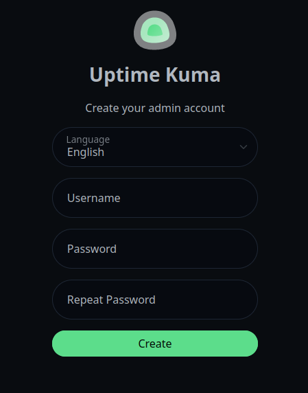
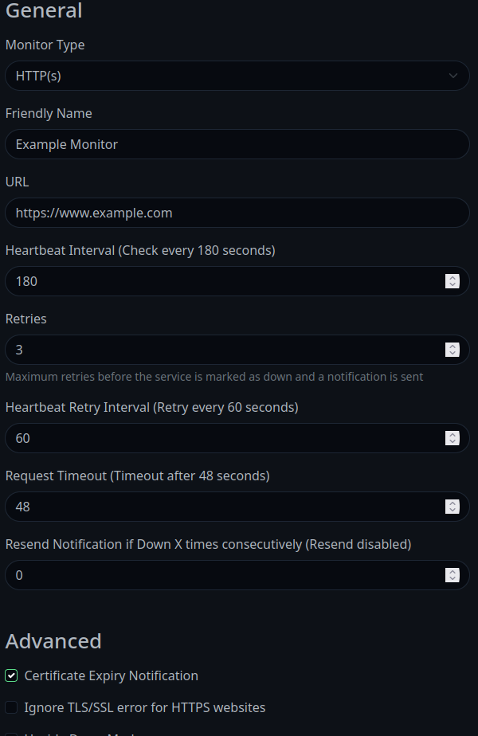

# Run Your First App
In this guide, you'll set up your first real app with Podinate. We'll set up Uptime Kuma, a self hosted uptime monitoring service, which will come in handy as you add more apps to your Kubernetes cluster with Podinate!

## Prepare Cluster
- Follow the [Quick Start Guide](../quick-start) to set up a local cluster for testing.

Guides for production setups coming soon
<!-- - Follow the [Home Lab Guide](home-lab) to set up a permanent cluster on hardware or a VM. -->

## Install Uptime Kuma
Create a file `uptime-kuma.pf` to create your Uptime Kuma instance.
```hcl title="uptime-kuma.pf"
podinate {
    package = "uptime-kuma"
    namespace = "uptime-kuma"
}

pod "uptime-kuma" {
    image = "louislam/uptime-kuma:1"
    service "kuma" {
        port = 80
        target_port = 3001
    }

    environment "PORT" {
        value = "3001"
    }
    
    volume "uptime-kuma" {
        mount_path = "/app/data"
        size = 1
    }
}
```

### Apply the PodFile
Apply the PodFile for Uptime Kuma with the following command: 
```bash
podinate apply uptime-kuma.pf
```
Press Y and then enter to accept the changes, and Podinate will create the Kubernetes objects necessary to run the Uptime Kuma Pod. 

### A Note on Namespaces
Kubernetes separates all objects into *Namespaces*, which can be used by cluster administrators to divide up cluster resources. To interact with Uptime Kuma through `kubectl`, you will have to specify the namespace with the `-n` flag like so:
```bash
kubectl -n uptime-kuma get pods
```

## Use the Uptime Kuma Interface
You can now connect to the Uptime Kuma web interface using Kubectl:
```bash
kubectl -n uptime-kuma port-forward services/kuma 8080:
```
Access the Uptime Kuma web interface by going to the following address in the browser:
```
http://localhost:8080
```
Set up a username and password on the initial screen as shown.



## Add a Monitor
Using the Uptime Kuma web interface, click "Add New Monitor". Check the screenshot below for a good example configuration:



## Configure Notifications
Go to "Add New Monitor" then "Setup Notification". Uptime Kuma supports a vast array of alerting mechanisms. If you just want something to test, maybe try a Discord Channel to get a message if Uptime Kuma is unable to reach your services. 

## What Next? 
Uptime Kuma is all ready to go. You can continue to use `kubectl port-forward` to access the web interface whenever you need to make changes, and this is ideal for security.

- Check out the [Uptime Kuma](../applications/uptime-kuma.md) Wiki page for more you can do with Uptime Kuma
- Set up [Nginx Ingress](../kubernetes/ingress.md), or [CloudFlare Tunnels](../applications/cloudflare-tunnel.md)